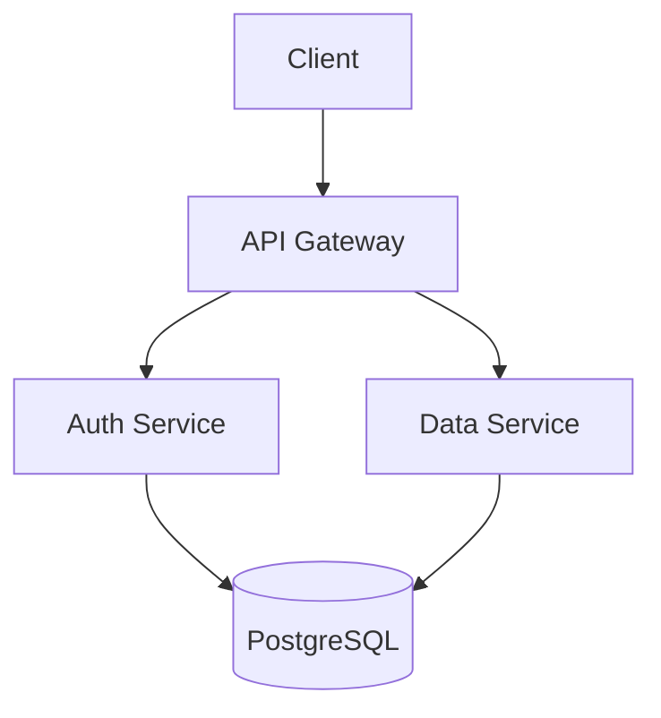

# 📊 Visual Explainer

## Output Formats

### 1. HTML Page
```html
<!DOCTYPE html>
<html>
<head><title>Architecture Overview</title>
<style>
  body { font-family: system-ui; max-width: 800px; margin: 0 auto; padding: 2rem; }
  .box { border: 2px solid #333; padding: 1rem; margin: 1rem 0; border-radius: 8px; }
  .arrow { text-align: center; font-size: 2rem; }
</style>
</head>
<body>
  <h1>System Architecture</h1>
  <div class="box">Client (React)</div>
  <div class="arrow">↓</div>
  <div class="box">API Gateway (Nginx)</div>
  <div class="arrow">↓</div>
  <div class="box">Services (Node.js)</div>
</body>
</html>
```

### 2. Mermaid Diagram


### 3. ASCII Diagram
```
┌─────────┐     ┌─────────────┐     ┌──────────┐
│  Client │────→│ API Gateway │────→│ Services │
└─────────┘     └─────────────┘     └────┬─────┘
                                         │
                                    ┌────┴────┐
                                    │   DB    │
                                    └─────────┘
```

## When to use
- Architecture explanations
- Data flow diagrams
- Decision trees
- Comparison tables
- Timeline views
- State machines

## Rules
- Always self-contained (single file)
- Use inline CSS/JS (no external deps)
- Mobile-responsive
- Dark mode support if possible
